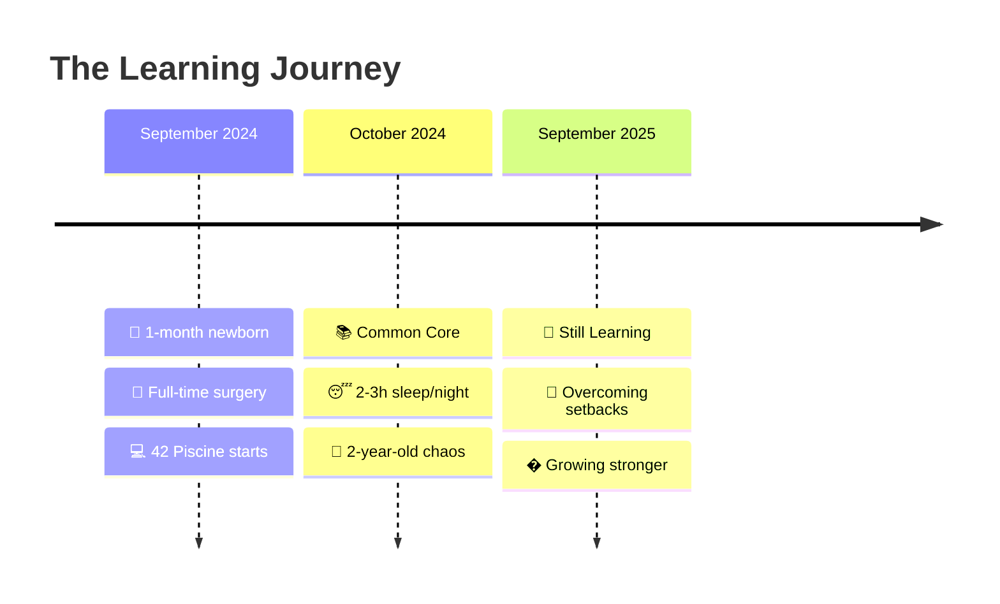
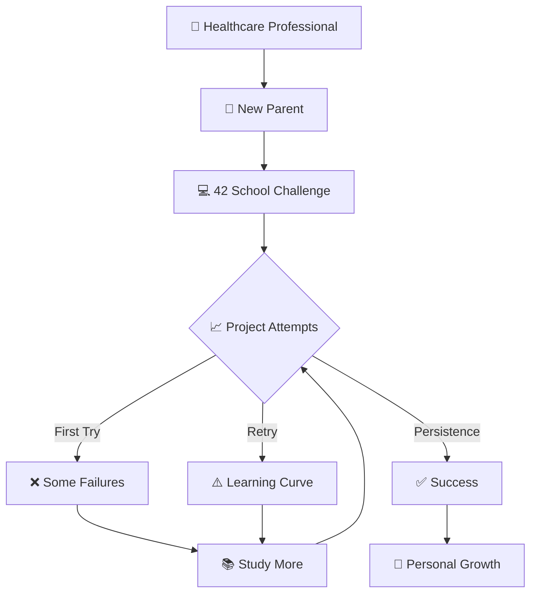

#

<div align="center">


</div>

<div align="center">

[](https://git.io/typing-svg)

</div>

---

## 🌟 The Impossible Journey

<div align="center">

<table>
<tr>
<td width="48%" align="center">

### ⚡ **The Challenge**

<div style="background: linear-gradient(135deg, #667eea 0%, #764ba2 100%); border-radius: 15px; padding: 20px; margin: 10px;">



**Coding between surgeries, feedings, and sleepless nights**

*When the path got tough, I chose to keep learning.*

</div>

</td>
<td width="4%"></td>
<td width="48%" align="center">

### 🏆 **The Real Journey**

<div align="center">


```typescript
const realJourney = {
  duration: "11 months",
  obstacles: [
    "👶 Newborn care 24/7",
    "🧒 Active 2-year-old",
    "🏥 Life-critical surgeries",
    "💻 Intensive coding challenges",
    "😴 Extreme sleep deprivation"
  ],
  reality: {
    failures: "Multiple retries",
    struggles: "Real and challenging",
    mindset: "never_give_up"
  }
};

console.log("Learning from every setback 💪");
```

</div>

</td>
</tr>
</table>

</div>

---

## 🎯 Professional Evolution

<div align="center">


</div>

<div align="center">
<table>
<tr>
<td align="center" width="20%">


**2020**
🏥 **Surgical Career**
*OR & Anesthesia*
*ULSEDV Hospital*

</td>
<td align="center" width="20%">


**Sep 2024**
👶 **Ambitious Start**
*42 Piscine*
*1-month newborn*

</td>
<td align="center" width="20%">


**Oct 2024**
💻 **Learning Journey**
*Projects & Challenges*
*Some retries*

</td>
<td align="center" width="20%">


**Sep 2025**
📚 **Still Growing**
*Continuous Learning*
*Perseverance*

</td>
<td align="center" width="20%">


**Oct 2025**
🚀 **Next Level**
*SEA:ME Automotive*
*HealthTech Focus*

</td>
</tr>
</table>
</div>

---

## � The Learning Journey

<div align="center">

### 💪 **Embracing Growth Through Challenges**

<div style="background: linear-gradient(135deg, #667eea 0%, #764ba2 100%); border-radius: 20px; padding: 25px; margin: 20px; color: white;">

<table>
<tr>
<td width="50%" align="center">

### 🎯 **The Reality**



**Every failure taught me something valuable**

</td>
<td width="50%" align="center">

### 🚀 **The Mindset**

<div style="background: rgba(255,255,255,0.1); border-radius: 15px; padding: 20px; margin: 10px;">

**✨ Key Lessons Learned:**

🔄 **Failure is feedback, not final**
💪 **Persistence beats perfection**
🧠 **Growth mindset over ego**
👥 **Asking for help is strength**
⏰ **Progress over speed**
🎯 **Each retry builds resilience**

*"The best developers aren't those who never fail, but those who learn from every failure."*

</div>

</td>
</tr>
</table>

</div>

### 📊 **Honest Progress Tracking**

<div align="center">

| 🎯 Skill Area | 📈 Progress | 💭 Learning Notes |
|:-------------|:-----------:|:------------------|
| **C Programming** | 🟩🟩🟩🟨⬜ 70% | *Solid foundation, still improving* |
| **Algorithms** | 🟩🟩🟨⬜⬜ 60% | *Complex problems need more practice* |
| **System Programming** | 🟩🟩🟩⬜⬜ 65% | *Understanding deepens with each project* |
| **Web Development** | 🟩🟩🟩🟩⬜ 80% | *Frontend skills growing stronger* |
| **Problem Solving** | 🟩🟩🟩🟩🟨 85% | *Healthcare experience helps here* |
| **Debugging** | 🟩🟩🟩🟩⬜ 75% | *Getting better at finding root causes* |

</div>

</div>

---

## 🏆 42 Porto Learning Experience

<div align="center">

### 🌟 **Projects & Learning**

<table>
<tr>
<td align="center" width="25%">

<div style="background: linear-gradient(45deg, #4CAF50, #45a049); border-radius: 10px; padding: 15px;">


**📚 C Library Recreation**
*Foundation building*
*Memory management*

</div>

</td>
<td align="center" width="25%">

<div style="background: linear-gradient(45deg, #FF9800, #F57C00); border-radius: 10px; padding: 15px;">


**📖 File Reading**
*Learning file I/O*
*Dynamic allocation*

</div>

</td>
<td align="center" width="25%">

<div style="background: linear-gradient(45deg, #2196F3, #1976D2); border-radius: 10px; padding: 15px;">


**🖨️ Printf Recreation**
*Variadic functions*
*Format handling*

</div>

</td>
<td align="center" width="25%">

<div style="background: linear-gradient(45deg, #9C27B0, #7B1FA2); border-radius: 10px; padding: 15px;">


**� Algorithm Challenge**
*Sorting optimization*
*Multiple attempts*

</div>

</td>
</tr>
</table>

<details>
<summary><b>📂 Complete Learning Portfolio (Click to see my journey)</b></summary>

<br>

<div align="center">

| � Project | 📊 Status | 🔧 Core Skills | 🚀 Complexity | � Learnings |
|:-----------|:--------:|:---------------|:----------:|:---------:|
| **libft** |  | C Library, Memory Management | � **Foundation** | Memory safety |
| **get_next_line** |  | File I/O, Dynamic Memory | � **Foundation** | Buffer management |
| **ft_printf** |  | Variadic Functions, Formatting | � **Intermediate** | Parameter handling |
| **Born2beroot** |  | System Administration | 🟡 **Intermediate** | Linux mastery |
| **push_swap** |  | Algorithms, Optimization | � **Advanced** | Problem solving |
| **minitalk** |  | UNIX Signals, IPC | 🟡 **Intermediate** | Process communication |
| **so_long** |  | 2D Game, Graphics | � **Intermediate** | Game development |

</div>

<div align="center">

**🎯 Learning Metrics**
- 📚 **Active learning** with multiple retries when needed
- 💪 **Growth mindset** - every failure teaches something
- 🎯 **Healthcare precision** applied to debugging
- 🌱 **Continuous improvement** over perfection

</div>

</details>

</div>

---

## 💻 Technical Arsenal

<div align="center">

### 🚀 **Core Technologies**

<table>
<tr>
<td align="center" width="25%">

<div style="background: linear-gradient(135deg, #667eea 0%, #764ba2 100%); border-radius: 15px; padding: 20px; color: white;">

**🔧 Systems Programming**

<br>


*Low-level mastery*

</div>

</td>
<td align="center" width="25%">

<div style="background: linear-gradient(135deg, #f093fb 0%, #f5576c 100%); border-radius: 15px; padding: 20px; color: white;">

**🌐 Web Development**

<br>


*Modern frontend*

</div>

</td>
<td align="center" width="25%">

<div style="background: linear-gradient(135deg, #4facfe 0%, #00f2fe 100%); border-radius: 15px; padding: 20px; color: white;">

**⚙️ Backend & DevOps**

<br>


*Infrastructure ready*

</div>

</td>
<td align="center" width="25%">

<div style="background: linear-gradient(135deg, #fa709a 0%, #fee140 100%); border-radius: 15px; padding: 20px; color: white;">

**🩺 Unique Edge**

<br>

🏥 **5 years surgery**
🌍 **4 languages**
⚡ **Crisis management**
🎯 **Zero-error mindset**

*Healthcare precision*

</div>

</td>
</tr>
</table>

### ⚡ **The Healthcare Developer Journey**

```cpp
class HealthcareDeveloper {
private:
    struct Experience {
        int healthcare_years = 5;
        int surgeries_completed = 500;
        double perfectionism = 0.95;  // High, but human
        bool learning_from_mistakes = true;
    };

    struct Skills {
        vector<string> languages = {"Portuguese", "French", "English", "Italian"};
        string mindset = "growth_oriented";
        bool handles_pressure = true;
        bool embraces_failure_as_learning = true;
    };

public:
    string getUniqueProposition() {
        return "🩺 Healthcare precision meets 💻 coding passion\n"
               "✅ Proven resilience under pressure\n"
               "� Growth mindset through challenges\n"
               "🚀 Learning from every setback";
    }

    bool canLearnFromFailure() {
        return true; // Essential skill in both surgery and coding
    }

    string getCurrentFocus() {
        return "Building solid fundamentals while balancing family life 👨‍👩‍�‍�";
    }
};
```

</div>

---

## � The Power of Perseverance

<div align="center">

<table>
<tr>
<td width="50%" align="center">

### 🌱 **Growth Mindset in Action**

<div style="background: linear-gradient(135deg, #667eea 0%, #764ba2 100%); border-radius: 15px; padding: 25px; color: white; margin: 10px;">

**📚 Learning Philosophy:**

🔄 **Embrace the Retry**
*Every failed attempt teaches something new*

💪 **Resilience Over Perfection**
*Healthcare taught me that precision comes with practice*

🤝 **Community Learning**
*Asking for help is a superpower*

⏰ **Balance is Key**
*Family first, coding passion second, but both matter*

🎯 **Progress Over Speed**
*Sustainable learning with a newborn and toddler*

</div>

</td>
<td width="50%" align="center">

### 🏥➡️💻 **Transferable Skills**

<div style="background: linear-gradient(135deg, #f093fb 0%, #f5576c 100%); border-radius: 15px; padding: 25px; color: white; margin: 10px;">

**From OR to IDE:**

🧠 **Problem-Solving Under Pressure**
*Life-critical decisions → Debug critical code*

🔍 **Attention to Detail**
*Patient safety → Code quality*

📚 **Continuous Learning**
*Medical updates → New technologies*

👥 **Team Collaboration**
*Surgical teams → Dev teams*

⏰ **Time Management**
*Surgery schedules → Project deadlines*

🌟 **Empathy & Communication**
*Patient care → User experience*

</div>

</td>
</tr>
</table>

<div style="background: rgba(255,255,255,0.1); border-radius: 15px; padding: 20px; margin: 20px;">

### 💭 **Honest Reflections**

*"Some days I code between feeding sessions at 3 AM. Some projects take me multiple attempts. Some concepts need weeks to click. But every small step forward feels like a victory when you're juggling healthcare work, family life, and learning to code."*

**🚀 The journey isn't about being perfect—it's about being persistent.**

</div>

</div>

---

## �📊 GitHub Analytics & Performance

<div align="center">


### 🏆 **Learning Progress Showcase**

<div align="center">


</div>

### 📈 **Coding Activity Visualization**

<div align="center">

[](https://github.com/ashutosh00710/github-readme-activity-graph)

</div>

### ⚡ **Real-time Metrics**

<div align="center">

<table>
<tr>
<td align="center">


**Current Status**

</td>
<td align="center">


**Life Balance**

</td>
<td align="center">


**Experience**

</td>
</tr>
</table>

</div>

</div>

---

## 🚀 Next Chapter: Continuing the Journey

<div align="center">

<table>
<tr>
<td width="35%" align="center">


</td>
<td width="65%">

### 🎯 **Learning Goals & Aspirations**

<div style="background: linear-gradient(135deg, #667eea 0%, #764ba2 100%); border-radius: 15px; padding: 25px; color: white;">

**🌱 Current Learning Focus**

Building strong fundamentals while managing family life and healthcare responsibilities. Every small step counts, and I'm learning to celebrate progress over perfection.

### 🎯 **Areas of Interest:**

🩺 **HealthTech Applications**
*Combining medical knowledge with technology*

� **Automotive Safety Systems**
*SEA:ME program aspiration for October 2025*

💻 **Full-Stack Development**
*Building complete solutions*

� **Problem-Solving Algorithms**
*The logical puzzle-solving aspect*

</div>

*"Every expert was once a beginner who refused to give up"*

</td>
</tr>
</table>

</div>

---

## 🌍 Let's Build the Future Together

<div align="center">

### 🤝 **Connect & Collaborate**

<table>
<tr>
<td align="center" width="33%">

<div style="background: linear-gradient(45deg, #0077B5, #00A0DC); border-radius: 15px; padding: 20px;">

[](https://www.linkedin.com/in/melanie-ferraz-reis-622229a5)

**Professional Network**
*Career opportunities*
*Industry connections*

</div>

</td>
<td align="center" width="33%">

<div style="background: linear-gradient(45deg, #D14836, #FF6B6B); border-radius: 15px; padding: 20px;">

[](mailto:melanie.ferraz@ua.pt)

**Direct Contact**
*Project collaborations*
*Technical discussions*

</div>

</td>
<td align="center" width="33%">

<div style="background: linear-gradient(45deg, #333333, #666666); border-radius: 15px; padding: 20px;">

[](https://github.com/melaniereis)

**Code Portfolio**
*Open source projects*
*Technical expertise*

</div>

</td>
</tr>
</table>

### 📍 **Current Status & Opportunities**

<div style="background: linear-gradient(135deg, #667eea 0%, #764ba2 100%); border-radius: 15px; padding: 25px; color: white; margin: 20px;">

🌍 **Based in Ovar, Portugal** 🇵🇹
🎯 **Currently:** Strengthening programming fundamentals at 42 Porto
💼 **Interested in:** Junior developer roles & learning opportunities
🚀 **Vision:** Combining healthcare experience with technology
✨ **Strength:** Resilience, growth mindset, and healthcare precision

</div>

<div align="center">


</div>

</div>

---

<div align="center">


### 💭 *"I approach code like I approach patient care—with dedication, continuous learning, and the understanding that every challenge is a chance to grow."*

**Ready to learn, grow, and contribute? Let's connect! 🚀**

<div style="font-size: 24px; margin: 20px;">

✨ **From healthcare precision to coding passion—learning every day** ✨

</div>

</div>
