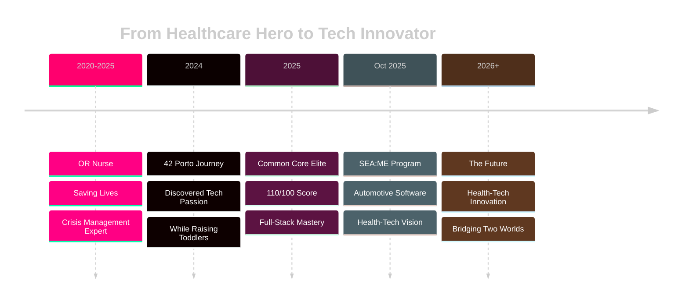

<div align="center">

<!-- Animated Wave Header with Gradient -->


<!-- Animated Typing with Gradient Background -->
<div>
  
</div>

<!-- Profile Image with Animated Border -->
<br>


<!-- Animated Stats Badges -->
<br><br>
<a href="https://github.com/melaniereis">
  
</a>
<a href="https://github.com/melaniereis?tab=repositories">
  
</a>
<a href="#">
  
</a>

</div>

<!-- Gradient Divider -->


<br>

<!-- About Section with Glassmorphic Design -->
<div align="center">
  <picture>
    <source media="(prefers-color-scheme: dark)" srcset="https://readme-typing-svg.demolab.com?font=Fira+Code&weight=600&size=28&pause=1000&color=FF006E&center=true&vCenter=true&width=435&lines=%F0%9F%8C%9F+About+Me">
    
  </picture>
</div>

<table align="center">
<tr>
<td width="50%">


### 🚀 **The Journey**

```javascript
const melanie = {
  currentRole: "OR Nurse → Software Engineer",
  education: "42 Porto Elite (110/100)",
  nextStep: "SEA:ME Automotive Systems",
  passion: ["HealthTech", "Innovation", "Safety"],
  languages: ["PT", "FR", "EN", "IT"],
  superpower: "Debugging while parenting toddlers"
};
```

🔬 **5 years** saving lives in the OR  
💻 **Now** building life-changing software  
🎯 **Mission**: Bridge healthcare & technology  

</td>
</tr>
</table>

<!-- Animated Skills Section -->
<br>

<div align="center">
  <picture>
    <source media="(prefers-color-scheme: dark)" srcset="https://readme-typing-svg.demolab.com?font=Fira+Code&weight=600&size=28&pause=1000&color=8338EC&center=true&vCenter=true&width=435&lines=%E2%9A%A1+Tech+Arsenal">
    
  </picture>
</div>

<br>

<div align="center">
  
### 🎨 **Core Technologies**


### 🛠️ **Tools & Systems**


### 🌐 **Web & Frameworks**


</div>

<!-- Animated GitHub Stats -->
<br>

<div align="center">
  <picture>
    <source media="(prefers-color-scheme: dark)" srcset="https://readme-typing-svg.demolab.com?font=Fira+Code&weight=600&size=28&pause=1000&color=3A86FF&center=true&vCenter=true&width=435&lines=%F0%9F%93%8A+Performance+Metrics">
    
  </picture>
</div>

<br>

<div align="center">
  
  
</div>

<!-- Activity Graph with Custom Theme -->
<div align="center">
  
</div>

<!-- Trophy Section -->
<div align="center">
  
</div>

<!-- Project Showcase -->
<br>

<div align="center">
  <picture>
    <source media="(prefers-color-scheme: dark)" srcset="https://readme-typing-svg.demolab.com?font=Fira+Code&weight=600&size=28&pause=1000&color=FF006E&center=true&vCenter=true&width=435&lines=%F0%9F%8F%86+Elite+Projects">
    
  </picture>
</div>

<br>

<div align="center">
<table>
<tr>
<td width="50%" align="center">

[](https://github.com/melaniereis/ft_transcendence)

**🎮 Full-Stack Gaming Platform**  
`Docker` `PostgreSQL` `WebSockets`  
⭐ **110/100**

</td>
<td width="50%" align="center">

[](https://github.com/m3irel3s/42_Cub3d)

**🎯 3D Raycasting Engine**  
`C` `Graphics` `Math`  
⭐ **125/100**

</td>
</tr>
<tr>
<td width="50%" align="center">

[](https://github.com/melaniereis/42_Minishell)

**🐚 Custom Shell**  
`C` `System Programming` `Parsing`  
⭐ **99/100**

</td>
<td width="50%" align="center">

[](https://github.com/melaniereis/webserv)

**🌐 HTTP Server**  
`C++` `Sockets` `HTTP/1.1`  
⭐ **100/100**

</td>
</tr>
</table>
</div>

<!-- Journey Timeline -->
<br>

<div align="center">
  <picture>
    <source media="(prefers-color-scheme: dark)" srcset="https://readme-typing-svg.demolab.com?font=Fira+Code&weight=600&size=28&pause=1000&color=8338EC&center=true&vCenter=true&width=435&lines=%F0%9F%9B%A4%EF%B8%8F+Career+Evolution">
    
  </picture>
</div>



<!-- What Makes Me Unique -->
<br>

<div align="center">
  <picture>
    <source media="(prefers-color-scheme: dark)" srcset="https://readme-typing-svg.demolab.com?font=Fira+Code&weight=600&size=28&pause=1000&color=3A86FF&center=true&vCenter=true&width=500&lines=%F0%9F%92%8E+Why+I'm+Different">
    
  </picture>
</div>

<br>

<div align="center">
<table>
<tr>
<td align="center" width="33%">
  
**🏥 Healthcare DNA**  
5 years in high-stakes OR  
Precision is my default  
Lives depend on quality  

</td>
<td align="center" width="33%">

**🚀 Tech Excellence**  
42 Porto Top Graduate  
Low-level to Full-Stack  
Safety-critical ready  

</td>
<td align="center" width="33%">

**🌍 Global Mindset**  
4 languages fluent  
Cross-cultural expert  
Remote-first ready  

</td>
</tr>
</table>
</div>

<!-- Connect Section -->
<br>

<div align="center">
  <picture>
    <source media="(prefers-color-scheme: dark)" srcset="https://readme-typing-svg.demolab.com?font=Fira+Code&weight=600&size=28&pause=1000&color=FF006E&center=true&vCenter=true&width=435&lines=%F0%9F%A4%9D+Let's+Connect">
    
  </picture>
</div>

<br>

<div align="center">
  
[](https://www.linkedin.com/in/melanie-ferraz-reis-622229a5)
[](mailto:melanie.ferraz@ua.pt)
[](https://profile.intra.42.fr/users/meferraz)
[](https://github.com/melaniereis)

</div>

<br>

<div align="center">
  
### 💭 **Open to Opportunities**

```diff
+ Software Engineer roles in Health-Tech or Automotive
+ Remote/Hybrid positions across Europe
+ Innovative projects that save or improve lives
+ Teams that value precision and quality
```

</div>

<!-- Contribution Snake -->
<div align="center">
  <picture>
    <source media="(prefers-color-scheme: dark)" srcset="https://raw.githubusercontent.com/melaniereis/melaniereis/output/github-contribution-grid-snake-dark.svg">
    <source media="(prefers-color-scheme: light)" srcset="https://raw.githubusercontent.com/melaniereis/melaniereis/output/github-contribution-grid-snake.svg">
    
  </picture>
</div>

<!-- Quote -->
<br>

<div align="center">

### 🌟 **_"Transforming surgical precision into code that heals the world"_** 🌟

<br>


</div>

<!-- Profile Views Counter -->
<div align="center">
  


</div>
