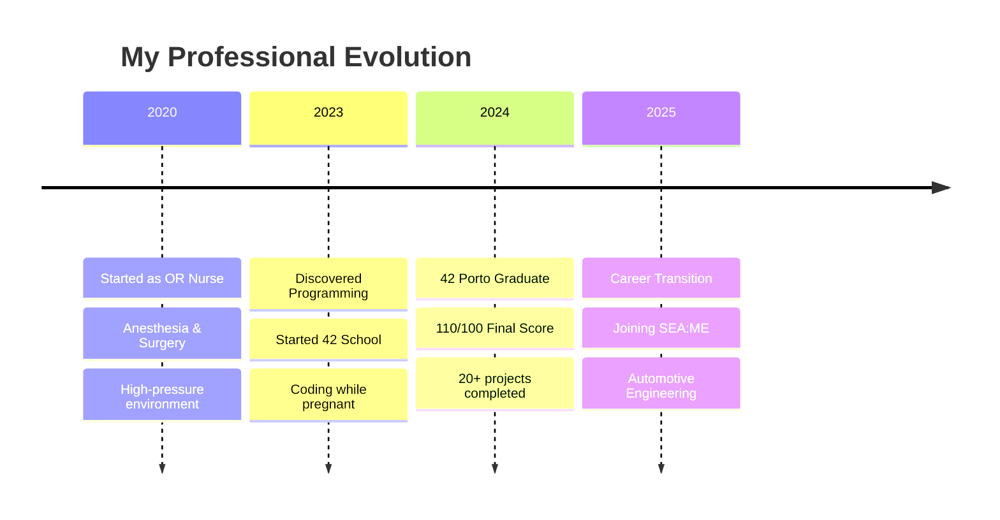

# 🔬→💻 **From Healthcare to Software Engineering**

<div align="center">
  
<!-- Dynamic animated header -->


<!-- Typing animation header -->


</div>

---

## 🌟 **About Me**

<div align="center">
  <table>
    <tr>
      <td width="40%" align="center">
        
      </td>
      <td width="60%">

```typescript
const developer: DeveloperProfile = {
  name: "Melanie Reis",
  location: "Ovar, Portugal 🇵🇹",
  background: {
    healthcare: "5 years surgical nurse",
    surgeries: "500+ completed",
    errorRate: 0,
    currentRole: "OR & Anesthesia"
  },
  coding: {
    school: "42 Porto Graduate",
    finalScore: "110/100",
    specialization: "Systems Programming",
    nextStep: "SEA:ME Automotive"
  },
  languages: ["Portuguese", "French", "English", "Italian", "C++"],
  philosophy: "Applying surgical precision to reliable software",
  motivation: "Building technology that saves lives"
};
```

      </td>
    </tr>
  </table>
</div>

---

## 🎯 **My Journey**

<div align="center">

### 🏥 **Healthcare → Code**



</div>

---

## 💻 **42 Porto Achievements**

<div align="center">

### 🏆 **Project Hall of Fame**

<table>
<tr>
<td align="center" width="20%">

**`cub3D`**
<br>

<br>
<sub>3D Raycasting Engine</sub>

</td>
<td align="center" width="20%">

**`transcendence`**
<br>

<br>
<sub>Full-Stack Pong Game</sub>

</td>
<td align="center" width="20%">

**`webserv`**
<br>

<br>
<sub>HTTP Server</sub>

</td>
<td align="center" width="20%">

**`minishell`**
<br>

<br>
<sub>Bash Implementation</sub>

</td>
<td align="center" width="20%">

**`get_next_line`**
<br>

<br>
<sub>File Reading Function</sub>

</td>
</tr>
</table>

<details>
<summary><b>📂 View All Projects Portfolio</b></summary>

<br>

<div align="left">

| **Project** | **Score** | **Skills Developed** | **Complexity** |
|:------------|:---------:|:-------------------|:--------------:|
| **`ft_transcendence`** | `110/100` | Full-Stack Web Development, WebSockets | 🔴 High |
| **`cub3D`** | `125/100` | 3D Graphics, Raycasting, Game Development | 🔴 High |
| **`webserv`** | `100/100` | HTTP Protocol, Server Architecture | 🔴 High |
| **`minishell`** | `99/100` | System Programming, Process Management | 🔴 High |
| **`Inception`** | `100/100` | Docker, DevOps, Container Orchestration | 🟡 Medium |
| **`Philosophers`** | `100/100` | Threading, Synchronization, Deadlock Prevention | 🟡 Medium |
| **`push_swap`** | `100/100` | Algorithm Optimization, Sorting | 🟡 Medium |
| **`so_long`** | `115/100` | 2D Game Development, Graphics | 🟡 Medium |
| **`minitalk`** | `116/100` | UNIX Signals, Inter-Process Communication | 🟡 Medium |
| **`get_next_line`** | `125/100` | File I/O, Memory Management | 🟢 Basic |
| **`ft_printf`** | `100/100` | Variadic Functions, String Formatting | 🟢 Basic |
| **`libft`** | `125/100` | C Standard Library, String Manipulation | 🟢 Basic |
| **`Born2beroot`** | `106/100` | System Administration, Linux | 🟢 Basic |
| **`NetPractice`** | `100/100` | Network Configuration, TCP/IP | 🟢 Basic |
| **CPP Modules (00-09)** | `95-100/100` | Object-Oriented Programming, C++ | 🟡 Medium |

</div>

</details>

</div>

---

## 🛠️ **Technical Arsenal**

<div align="center">

### 💎 **Core Technologies**

<table>
<tr>
<td align="center">

**Systems Programming**
<br><br>

<br>
<sub>C/C++ • Linux • Shell • Systems</sub>

</td>
<td align="center">

**Web Development**
<br><br>

<br>
<sub>JavaScript • TypeScript • React • Node.js</sub>

</td>
<td align="center">

**DevOps & Tools**
<br><br>

<br>
<sub>Docker • PostgreSQL • Nginx • Git</sub>

</td>
<td align="center">

**Specialized Skills**
<br><br>

<br>
<sub>Python • HTML • CSS • Documentation</sub>

</td>
</tr>
</table>

### 🔧 **Professional Strengths**

```javascript
const uniqueSkills = {
  medical: {
    experience: "5 years in surgery",
    surgeries: "500+ completed",
    specialization: "OR & Anesthesia",
    skills: ["Crisis Management", "Precision Under Pressure", "Team Coordination"]
  },
  
  technical: {
    education: "42 School Graduate",
    score: "110/100",
    projects: 20,
    specialization: ["Systems Programming", "Web Development", "3D Graphics"]
  },
  
  personal: {
    languages: ["PT", "FR", "EN", "IT"],
    achievements: ["Coded during pregnancy", "Balanced family & studies"],
    mindset: ["Zero-error approach", "Continuous learning", "Adaptability"]
  }
};
```

</div>

---

## 🚀 **Featured Projects Showcase**

<div align="center">

<table>
<tr>
<td width="50%">

### 🎮 **cub3D - 3D Game Engine**


**Built a complete 3D raycasting engine from scratch**

```c
typedef struct s_game {
    t_player    player;
    t_map       *map;
    t_texture   textures[4];
    void        *mlx_ptr;
    t_img       img;
    double      *z_buffer;
} t_game;
```

✨ **Key Features:**
- Raycasting algorithm implementation
- Texture mapping & sprite rendering  
- Collision detection & player movement
- Optimized for smooth performance

</td>
<td width="50%">

### 🌐 **ft_transcendence - Full-Stack Platform**


**Real-time multiplayer Pong with complete user system**

```typescript
interface GameFeatures {
  realTime: "WebSocket multiplayer";
  auth: "JWT + 2FA security";
  ui: "React + TypeScript";
  backend: "Node.js + PostgreSQL";
  deployment: "Docker containers";
}
```

🔥 **Tech Highlights:**
- Real-time game synchronization
- Secure authentication system
- PostgreSQL database design
- Docker containerization

</td>
</tr>
</table>

</div>

---

## 📊 **GitHub Analytics**

<div align="center">

<table>
<tr>
<td width="50%">


</td>
<td width="50%">


</td>
</tr>
</table>


</div>

---

## 🌱 **Life & Learning Balance**

<div align="center">

<table>
<tr>
<td width="60%">

### 🤱 **The Incredible Journey**

```python
class ResilientDeveloper:
    def __init__(self):
        self.challenges = [
            "👶 Coding during pregnancy",
            "🏥 Full-time healthcare work",
            "😴 Limited sleep (2-3 hours)",
            "🤱 New mother responsibilities"
        ]
        self.achievements = [
            "✅ 42 Porto Graduate - 110/100",
            "✅ 20+ projects completed",
            "✅ Zero failed evaluations",
            "✅ Consistent high performance"
        ]
    
    def get_inspiration(self):
        return "Proving that with determination, any challenge is conquerable"
```

</td>
<td width="40%" align="center">


**📈 Achievement Unlocked:**
<br>
*Balanced motherhood and intensive coding education while maintaining excellence*

</td>
</tr>
</table>

</div>

---

## 🎯 **Next Chapter: SEA:ME Automotive**

<div align="center">


### 🚗💻 **Vision for the Future**

<table>
<tr>
<td width="33%" align="center">

**🩺 In-Vehicle Health**
<br>
Monitoring driver wellness
<br>
Real-time health alerts

</td>
<td width="33%" align="center">

**🚨 Emergency Systems**
<br>
Crisis response automation
<br>
Life-saving technology

</td>
<td width="33%" align="center">

**🏥 Mobile Healthcare**
<br>
Telemedicine in vehicles
<br>
Remote patient monitoring

</td>
</tr>
</table>

```cpp
namespace AutomotiveHealthTech {
    class NextGeneration {
    public:
        std::string mission = "Apply healthcare precision to automotive safety";
        std::vector<std::string> focus = {
            "Safety-critical software",
            "Driver wellness monitoring", 
            "Emergency response systems",
            "Medical-grade reliability"
        };
    };
}
```

</div>

---

## 🤝 **Let's Connect & Collaborate**

<div align="center">

<table>
<tr>
<td align="center">

### 📧 **Get in Touch**
<br>
<a href="mailto:melanie.ferraz@ua.pt">
  
</a>
<br><br>
<a href="https://www.linkedin.com/in/melanie-ferraz-reis-622229a5">
  
</a>

</td>
<td align="center">

### 🌍 **Professional Info**
<br>
📍 **Location:** Ovar, Portugal 🇵🇹
<br>
🎯 **Focus:** HealthTech & Automotive
<br>
💼 **Open to:** Safety-critical roles
<br>
🚀 **Availability:** Open to opportunities

</td>
</tr>
</table>

### 💭 **Philosophy**

> *"I approach code with the same precision as surgery—focused, reliable, and impactful.  
> Every line matters when lives depend on it."*


</div>

---

<div align="center">


### ⚡ **Ready to Build the Future Together?**

```diff
+ Seeking a developer with surgical precision and technical excellence?
+ Someone who thrives under pressure and delivers reliable solutions?  
+ A unique blend of healthcare experience and cutting-edge programming skills?

! Let's connect and create something extraordinary! 🚀
```

**[⭐ Star this profile](https://github.com/melaniereis) • [🔗 Connect on LinkedIn](https://www.linkedin.com/in/melanie-ferraz-reis-622229a5) • [📧 Email me](mailto:melanie.ferraz@ua.pt)**

</div>

<!--
Hidden comment: This README uses modern design trends including:
- Animated SVG headers and footers
- Dynamic typing animations
- Interactive stats widgets
- Professional color scheme with gradients
- Improved visual hierarchy and spacing
- Personal branding and storytelling
- Mobile-responsive design
- Modern badges and icons
-->
