# 👋 Hi, I'm Melanie Reis

<p align="center">
  
</p>

<div align="center">
  
</div>

<div align="center" style="margin: 2em 0;">
  
  <h2>🏥 From Operating Room Precision to Software Mastery</h2>
  <p><strong>With 5 years as an Operating Room Nurse (2020–2025), I've mastered high-stakes decision-making and flawless execution. Now, as a 42 Porto graduate, I'm leveraging those skills in software engineering—passionate about health tech innovations while pursuing automotive systems.</strong></p>
  <p>🔭 Wrapping up my nursing role this month to focus on tech full-time</p>
  <p>🌱 Starting SEA:ME in October 2025, excited to blend mobility tech with health applications (e.g., in-vehicle health monitoring)</p>
  <p>💡 Committed to health tech: Envisioning solutions like AI-assisted diagnostics or connected medical devices</p>
  <p>🌎 Fluent in Portuguese, French, English, and Italian for global collaboration</p>
  <p>👩‍👧‍👦 Achieved tech milestones while raising two toddlers under 3</p>
  <p>📍 Portugal-based, open to remote/international opportunities</p>
</div>

<p align="center">
  
  
</p>

## 🔧 Technical Skills & Arsenal

<div align="center" style="margin: 2em 0;">
  
</div>

<div align="center">
  <p><strong>Expertise:</strong> Low-level programming (C/C++), system design, concurrency, networking, containerization, algorithms. Ready for safety-critical roles in health tech or automotive.</p>
</div>

## 📊 My GitHub Stats

<div align="center">
  
  
  
</div>

<div align="center">
  
</div>

<div align="center">
  
</div>

## 📅 My Journey: From Healthcare to Tech

```mermaid
timeline
    title Career Timeline
    section Healthcare
      2020 : Started as Surgical Nurse
      2020-2025 : Surgical and OR Nurse - used to high-pressure surgeries
    section Tech Transition
      2024 : Joined 42 Porto Common Core
      2025 : Completed Common Core with 110/100
    section Future
      Oct 2025 : Start SEA&#58;ME Specialization
      2026+ : Innovate in Health-Tech & Automotive
```



## 🏆 42 Porto Projects: Proven Technical Prowess

<details>
<summary>🎯 Advanced Full-Stack & Web Projects</summary>

| Project | Description | Score | Technologies | Repository |
|---------|-------------|-------|--------------|------------|
| **ft_transcendence** |  Web-based Pong gaming platform |  | Docker, PostgreSQL, WebSockets | [Repo](https://github.com/melaniereis/ft_transcendence) |
| **webserv** | Custom HTTP/1.1 server from scratch |  | C++, Sockets, HTTP | [Repo](https://github.com/melaniereis/webserv) |
| **Inception** | Multi-service containerized infrastructure |  | Docker, Nginx, DB | [Repo](https://github.com/melaniereis/Inception) |

</details>

<details>
<summary>⚙️ Systems, Graphics & Algorithms</summary>

| Project | Description | Score | Technologies | Repository |
|---------|-------------|-------|--------------|------------|
| **cub3D** | 3D raycasting game engine |  | C, Raycasting, MLX | [Repo](https://github.com/m3irel3s/42_Cub3d) |
| **minishell** | Custom shell with command parsing |  | C, Parsing, Exec | [Repo](https://github.com/melaniereis/42_Minishell) |
| **Philosophers** | Concurrency & deadlock prevention |  | C, Threads/Mutex | [Repo](https://github.com/melaniereis/42_philosophers) |
| **push_swap** | Efficient stack sorting algorithm |  | C, Algorithms | [Repo](https://github.com/melaniereis/42_push_swap) |
| **so_long** | 2D game with map validation |  | C, Graphics, Pathfinding | [Repo](https://github.com/melaniereis/42_so_long) |
| **minitalk** | Signal-based IPC system |  | C, Signals | [Repo](https://github.com/melaniereis/42_minitalk) |

</details>

<details>
<summary>📚 Foundations & C++ Mastery</summary>

| Project/Module | Description | Score | Technologies | Repository |
|----------------|-------------|-------|--------------|------------|
| **CPP Module 09** | Advanced containers & algorithms |  | C++ | [Repo](https://github.com/melaniereis/CPP_Module09) |
| **CPP Module 04** | Polymorphism & interfaces |  | C++ | [Repo](https://github.com/melaniereis/CPP_Module04) |
| **Born2beroot** | Secure VM setup & monitoring |  | Linux, SysAdmin | [Repo](https://github.com/melaniereis/Born2beroot) |
| **NetPractice** | IP/TCP network configs |  | Networking | [Repo](https://github.com/melaniereis/42_NetPractice) |
| **get_next_line** | Buffered file reading |  | C, I/O | [Repo](https://github.com/melaniereis/42_get_next_line) |
| **ft_printf** | Formatted output function |  | C, Variadics | [Repo](https://github.com/melaniereis/42_ft_printf) |
| **Libft** | Custom libc functions |  | C | [Repo](https://github.com/melaniereis/libft) |

*(C++ Modules 00–03, 05–08: All 95–100%. Full mastery of OOP, memory management, and advanced concepts.)*

</details>

## 🚀 Upcoming: SEA:ME Specialization (Oct 2025)

<div align="center" style="margin: 2em 0; background: linear-gradient(135deg, #1a1a1a, #2d2d2d); padding: 2rem; border-radius: 15px; max-width: 800px; box-shadow: 0 4px 8px rgba(0,0,0,0.2);">
  <p><strong>Software Engineering in Automotive & Mobility Ecosystems</strong>: Master-level focus on embedded systems for connected, safe mobility.</p>
  <ul style="text-align: left; max-width: 600px;">
    <li>🚗 Vehicle software architectures & RTOS</li>
    <li>🔒 Functional safety (ISO 26262)</li>
    <li>🤖 Autonomous systems & connectivity</li>
  </ul>
  <p>My health passion drives me to explore automotive-health fusions, like telematics for emergency response or wellness dashboards.</p>
</div>

## 💡 Why Hire Me? Unique Blend of Skills

I'm seeking junior/mid-level Software Engineer roles in health tech, automotive, or mobility—where precision saves lives or drives innovation.

| Nursing Superpower | → | Engineering Impact |
|--------------------|---|--------------------|
| Crisis management in OR | → | Robust, fault-tolerant systems |
| Surgical accuracy & protocols | → | Clean code & quality assurance |
| Team leadership under pressure | → | Agile collaboration & delivery |
| Patient safety focus | → | Ethical, user-centric design |

<div style="display: flex; flex-wrap: wrap; justify-content: center; gap: 1rem; margin: 2rem 0;">
  <div style="background: linear-gradient(135deg, #1a1a1a, #2d2d2d); padding: 1.5rem; border-radius: 10px; border-left: 4px solid #2E8B57; width: 300px; box-shadow: 0 4px 8px rgba(0,0,0,0.2);">
    <h4>🏆 Proven Resilience</h4>
    <p>Top scores at 42 Porto while nursing full-time and parenting.</p>
  </div>
  <div style="background: linear-gradient(135deg, #1a1a1a, #2d2d2d); padding: 1.5rem; border-radius: 10px; border-left: 4px solid #4169E1; width: 300px; box-shadow: 0 4px 8px rgba(0,0,0,0.2);">
    <h4>💻 Health-Tech Drive</h4>
    <p>Eager for roles innovating at health-tech intersections.</p>
  </div>
  <div style="background: linear-gradient(135deg, #1a1a1a, #2d2d2d); padding: 1.5rem; border-radius: 10px; border-left: 4px solid #FF6B35; width: 300px; box-shadow: 0 4px 8px rgba(0,0,0,0.2);">
    <h4>🌍 Adaptable Collaborator</h4>
    <p>Multilingual, ready for diverse teams in Europe or beyond.</p>
  </div>
</div>

## 🎉 Fun Facts & Superpowers

<details>
<summary>Click to reveal some interesting trivia!</summary>
<ul>
  <li>🍼 Completed 42 Piscine with a newborn—talk about multitasking!</li>
  <li>🩺 Fixed memory leaks faster than scrubbing into the OR.</li>
  <li>👩‍💻 Proudest moment: Balancing code compilations with snack times for two under 3.</li>
  <li>🌟 Signature move: Writing clean code during nap times.</li>
</ul>
</details>

## 🌐 Connect & Discuss Opportunities

<div align="center" style="margin: 2em 0;">
  <a href="https://www.linkedin.com/in/melanie-ferraz-reis-622229a5"></a>
  <a href="mailto:melanie.ferraz@ua.pt"></a>
  <a href="https://42porto.com"></a>
</div>

<div align="center" style="margin-top: 3rem; padding: 2rem; background: linear-gradient(135deg, #1a1a1a, #2d2d2d 100%); border-radius: 15px; box-shadow: 0 4px 8px rgba(0,0,0,0.2);">
  <p><strong>"Blending surgical precision with code craftsmanship to create life-enhancing tech."</strong></p>
  <p>Open to Software Engineer positions—let's chat about how my background can add value to your team!</p>
</div>

```cpp
// Ready to Engineer the Future
class HealthTechEngineer {
public:
    HealthTechEngineer() : precision("Surgical"), passion("Health Innovation") {}
    void innovate() {
        return automotiveSafety + healthSolutions;
    }
};
```

<p align="center">
  
</p>
