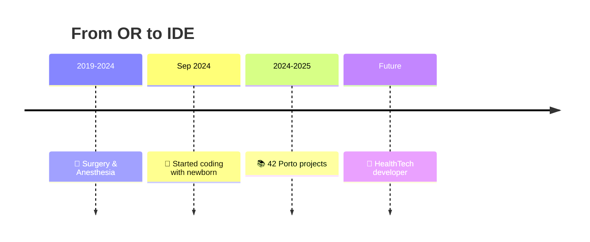

#

---

## 🚀 My Story in 30 Seconds

<table>
<tr>
<td width="50%" align="center">

### 🏥➡️💻 **The Journey**

*Learning to code between surgeries and feeding times*

</td>
<td width="50%" align="center">

### 💪 **What Makes Me Different**

🩺 **Healthcare Precision** - 5 years in life-critical environments
👶 **Ultimate Multitasking** - Coding with newborn & toddler
🌱 **Growth Mindset** - Every failure is a lesson
🌍 **4 Languages** - Portuguese, French, English, Italian
⚡ **Crisis Tested** - Performs under extreme pressure

</td>
</tr>
</table>

---

## 🛠️ Tech Stack & Projects

### 🔧 **Currently Learning**

### 📚 **42 Porto Progress**

| Project | Status | Skills Learned |
|:--------|:------:|:---------------|
| **libft** | ✅ Completed | C fundamentals, memory management |
| **get_next_line** | 🔄 In progress | File I/O, buffer handling |
| **ft_printf** | 📖 Learning | Variadic functions, formatting |
| **push_swap** | 💪 Challenge | Algorithms, optimization |

📊 <b>Honest Skills Assessment</b>

 

| Skill | Level | Notes |
|:------|:-----:|:------|
| **C Programming** | 🟩🟩🟩🟨⬜ 70% | Solid foundation, improving daily |
| **Problem Solving** | 🟩🟩🟩🟩🟨 85% | Healthcare experience helps |
| **Web Development** | 🟩🟩🟩⬜⬜ 60% | Frontend focus, learning backend |
| **Debugging** | 🟩🟩🟩🟩⬜ 75% | Methodical approach from healthcare |

*Real progress over perfect scores*

---

## 📈 GitHub Stats

---

## 🎯 What's Next

<table>
<tr>
<td width="60%">

### 🚀 **Goals for 2025**

🩺 **HealthTech Focus** - Combine medical knowledge with technology
🚗 **SEA:ME Automotive** - Safety-critical systems (if accepted)
💻 **Full-Stack Skills** - Complete web development journey
👥 **First Dev Role** - Junior position where I can grow and contribute

</td>
<td width="40%" align="center">

*Every expert was once a beginner*

</td>
</tr>
</table>

---

## 🤝 Let's Connect

**📍 Based in Ovar, Portugal 🇵🇹**

*Open to junior developer opportunities and learning collaborations*

---

**💭 "Coding with the same precision I bring to patient care - dedicated, resilient, always learning"**

