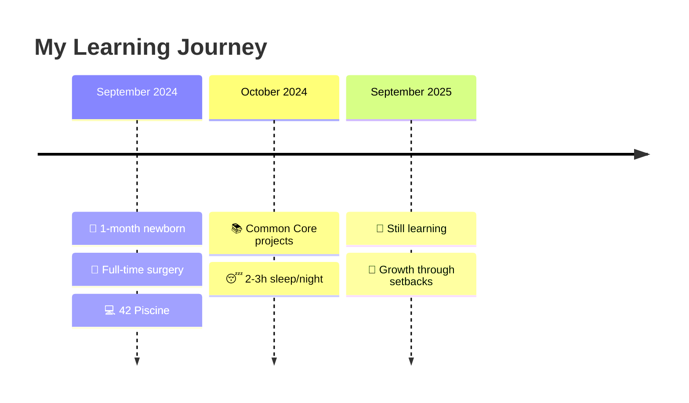

# 

---

## 🌟 The Journey: From Surgery to Code

<table>
<tr>
<td width="60%" align="center">

### ⚡ **The Challenge**

**Real obstacles. Real growth. Real determination.**

🔄 **Multiple retries** → Learning experiences  
💪 **Challenges faced** → Resilience built  
🌱 **Continuous improvement** → Never giving up

</td>
<td width="40%" align="center">

### 🏥➡️💻 **Unique Background**

**5 Years Healthcare Experience**
- 500+ surgeries completed
- Crisis management under pressure  
- Life-critical decision making
- Team collaboration mastery

**Current Reality: Learning to Code**
- 42 Porto student balancing family life
- Growth mindset through challenges
- Healthcare precision applied to debugging

</td>
</tr>
</table>

---

## 🚀 Skills & Projects

### 💻 **Technical Arsenal**

<table>
<tr>
<td align="center" width="25%">

**🔧 Systems Programming**  
*C, Shell, Linux fundamentals*

</td>
<td align="center" width="25%">

**🌐 Web Development**  
*JS, HTML, learning React*

</td>
<td align="center" width="25%">

**⚙️ Tools & Systems**  
*Docker, databases, DevOps basics*

</td>
<td align="center" width="25%">

🏥 **5 years surgery**  
🌍 **4 languages fluent**  
⚡ **Crisis management**  
🎯 **Healthcare precision**

**🩺 Unique Edge**

</td>
</tr>
</table>

### 🏆 **42 Porto Projects**

| 🎯 Project | 📊 Status | 🔧 Skills | 💡 Key Learning |
|:-----------|:--------:|:----------|:----------------|
| **libft** | ✅ Completed | C Library, Memory Management | Foundation building |
| **get_next_line** | 🔄 In Progress | File I/O, Dynamic Memory | Buffer management |
| **ft_printf** | 📚 Learning | Variadic Functions | Parameter handling |
| **push_swap** | 💪 Challenge | Algorithms, Optimization | Problem solving persistence |
| **Born2beroot** | 🔍 Exploring | System Administration | Linux deep dive |

**Learning Approach:** Growth mindset • Multiple retries when needed • Healthcare precision applied to debugging

---

## 📊 GitHub Analytics

---

## 🎯 What's Next

<table>
<tr>
<td width="50%" align="center">

### 🌱 **Current Focus**

**Building Solid Foundations**

📚 Mastering C programming fundamentals  
🔧 Understanding system-level concepts  
🧠 Developing algorithmic thinking  
🎯 Applying healthcare precision to code  

**Balance**: Family life + Healthcare work + Learning code

*"Every small step counts when you're learning with a newborn and toddler"*

</td>
<td width="50%" align="center">

### 🚀 **Future Aspirations**

**Where I'm Heading**

🩺 **HealthTech Development**  
*Combining medical expertise with technology*

🚗 **SEA:ME Automotive** (Oct 2025 goal)  
*Safety-critical systems*

💼 **Junior Developer Opportunities**  
*Ready to contribute and keep learning*

🌟 **Long-term Vision**: Bridging healthcare and technology

</td>
</tr>
</table>

---

## 🤝 Let's Connect

**🌍 Based in Ovar, Portugal** • **🎯 Open to junior dev opportunities** • **💪 Growth mindset always**

---

*"Approaching code with the same dedication as patient care—continuous learning, resilience, and turning every challenge into growth."*

**✨ From healthcare precision to coding passion—learning every day ✨**

