# 

<div align="center">


</div>

<div align="center">

[](https://git.io/typing-svg)

</div>

---

## 🌟 The Impossible Journey

<div align="center">

<table>
<tr>
<td width="48%" align="center">

### ⚡ **The Challenge**

```mermaid
timeline
    title The Impossible Timeline
    September 2024 : 👶 1-month newborn : 🏥 Full-time surgery : 💻 42 Piscine starts
    October 2024   : 📚 Common Core : 😴 2-3h sleep/night : 🧒 2-year-old chaos
    September 2025 : 🎓 Graduate : ⭐ 110/100 score : 🏆 Zero failures
```

<div style="background: linear-gradient(135deg, #667eea 0%, #764ba2 100%); border-radius: 15px; padding: 20px; margin: 10px;">



**Coding between surgeries, feedings, and sleepless nights**

*When everyone said "impossible," I made it inevitable.*

</div>

</td>
<td width="4%"></td>
<td width="48%" align="center">

### 🏆 **The Achievement**

<div align="center">


```typescript
const impossibleJourney = {
  duration: "11 months",
  obstacles: [
    "👶 Newborn care 24/7",
    "🧒 Active 2-year-old", 
    "🏥 Life-critical surgeries",
    "💻 Intensive coding bootcamp",
    "😴 Extreme sleep deprivation"
  ],
  result: {
    score: "110/100",
    failures: 0,
    mindset: "surgical_precision"
  }
};

console.log("Proving limits are illusions ✨");
```

</div>

</td>
</tr>
</table>

</div>

---

## 🎯 Professional Evolution

<div align="center">


</div>

<div align="center">
<table>
<tr>
<td align="center" width="20%">


**2020**  
🏥 **Surgical Career**  
*OR & Anesthesia*  
*ULSEDV Hospital*

</td>
<td align="center" width="20%">


**Sep 2024**  
👶 **Impossible Start**  
*42 Piscine*  
*1-month newborn*

</td>
<td align="center" width="20%">


**Oct 2024**  
💻 **Core Journey**  
*20+ Projects*  
*Zero failures*

</td>
<td align="center" width="20%">


**Sep 2025**  
🎓 **Excellence**  
*110/100 Graduate*  
*Mission accomplished*

</td>
<td align="center" width="20%">


**Oct 2025**  
🚀 **Next Level**  
*SEA:ME Automotive*  
*HealthTech Focus*

</td>
</tr>
</table>
</div>

---

## 🏆 42 Porto Mastery

<div align="center">

### 🌟 **Hall of Excellence**

<table>
<tr>
<td align="center" width="25%">

<div style="background: linear-gradient(45deg, #FFD700, #FFA500); border-radius: 10px; padding: 15px;">


**🎮 3D Graphics Engine**  
*Raycasting from scratch*  
*OpenGL mastery*

</div>

</td>
<td align="center" width="25%">

<div style="background: linear-gradient(45deg, #32CD32, #228B22); border-radius: 10px; padding: 15px;">


**🌐 Full-Stack Platform**  
*Real-time multiplayer*  
*WebSocket mastery*

</div>

</td>
<td align="center" width="25%">

<div style="background: linear-gradient(45deg, #1E90FF, #4169E1); border-radius: 10px; padding: 15px;">


**🌍 HTTP Server**  
*Built from ground up*  
*Protocol expertise*

</div>

</td>
<td align="center" width="25%">

<div style="background: linear-gradient(45deg, #FF1493, #DC143C); border-radius: 10px; padding: 15px;">


**🐚 Shell Implementation**  
*Bash-like functionality*  
*Process mastery*

</div>

</td>
</tr>
</table>

<details>
<summary><b>📂 Complete Project Portfolio (Click to expand all 20+ projects)</b></summary>

<br>

<div align="center">

| 🏆 Project | 📊 Score | 🔧 Core Skills | 🚀 Complexity | 📈 Impact |
|:-----------|:--------:|:---------------|:----------:|:---------:|
| **ft_transcendence** |  | Full-Stack, WebSockets, Real-time Gaming | 🔴 **Master** | Revolutionary |
| **cub3D** |  | 3D Graphics, Raycasting, MLX Graphics | 🔴 **Master** | Game-changing |
| **webserv** |  | HTTP Protocol, Server Architecture | 🔴 **Master** | Professional |
| **minishell** |  | Process Management, Advanced Parsing | 🔴 **Master** | System-level |
| **Inception** |  | Docker, DevOps, Container Orchestration | 🟡 **Advanced** | Industry-ready |
| **Philosophers** |  | Threading, Synchronization, Race Conditions | 🟡 **Advanced** | Concurrency |
| **push_swap** |  | Algorithm Optimization, Sorting | 🟡 **Advanced** | Mathematical |
| **so_long** |  | 2D Game Development, Graphics | 🟡 **Advanced** | Creative |
| **minitalk** |  | UNIX Signals, Inter-Process Communication | 🟡 **Advanced** | System IPC |
| **ft_printf** |  | Variadic Functions, Format Specifiers | 🟢 **Solid** | Fundamental |
| **get_next_line** |  | File I/O, Dynamic Memory Management | 🟢 **Solid** | Essential |
| **libft** |  | C Library Recreation, Memory Management | 🟢 **Solid** | Foundation |
| **Born2beroot** |  | System Administration, Security | 🟢 **Solid** | Infrastructure |
| **CPP Modules 00-09** |  | Object-Oriented Programming, STL | 🟡 **Advanced** | Modern C++ |

</div>

<div align="center">

**🎯 Performance Metrics**
- ✅ **Zero failed evaluations** across all projects
- 🏆 **Perfect attendance** despite family challenges
- ⚡ **Consistent excellence** under extreme pressure
- 💯 **110/100 final score** - Top tier achievement

</div>

</details>

</div>

---

## 💻 Technical Arsenal

<div align="center">

### 🚀 **Core Technologies**

<table>
<tr>
<td align="center" width="25%">

<div style="background: linear-gradient(135deg, #667eea 0%, #764ba2 100%); border-radius: 15px; padding: 20px; color: white;">

**🔧 Systems Programming**

<br>


*Low-level mastery*

</div>

</td>
<td align="center" width="25%">

<div style="background: linear-gradient(135deg, #f093fb 0%, #f5576c 100%); border-radius: 15px; padding: 20px; color: white;">

**🌐 Web Development**

<br>


*Modern frontend*

</div>

</td>
<td align="center" width="25%">

<div style="background: linear-gradient(135deg, #4facfe 0%, #00f2fe 100%); border-radius: 15px; padding: 20px; color: white;">

**⚙️ Backend & DevOps**

<br>


*Infrastructure ready*

</div>

</td>
<td align="center" width="25%">

<div style="background: linear-gradient(135deg, #fa709a 0%, #fee140 100%); border-radius: 15px; padding: 20px; color: white;">

**🩺 Unique Edge**

<br>

🏥 **5 years surgery**  
🌍 **4 languages**  
⚡ **Crisis management**  
🎯 **Zero-error mindset**  

*Healthcare precision*

</div>

</td>
</tr>
</table>

### ⚡ **The Surgical Developer Advantage**

```cpp
class SurgicalDeveloper {
private:
    struct Experience {
        int healthcare_years = 5;
        int surgeries_completed = 500;
        double error_tolerance = 0.0;
        bool crisis_tested = true;
    };
    
    struct Skills {
        vector<string> languages = {"Portuguese", "French", "English", "Italian"};
        string mindset = "surgical_precision";
        bool pressure_tested = true;
    };

public:
    string getUniqueProposition() {
        return "🩺 Healthcare precision meets 💻 technical excellence\n"
               "✅ Proven under extreme pressure\n"
               "🎯 Zero-error surgical mindset\n"
               "🚀 Crisis management expertise";
    }
    
    bool canDeliverUnderPressure() {
        return true; // Proven in OR and coding bootcamp with newborn
    }
    
    string getFutureVision() {
        return "Bridging healthcare and automotive for life-saving tech 🚗💚";
    }
};
```

</div>

---

## 📊 GitHub Analytics & Performance

<div align="center">


### 🏆 **Achievement Showcase**

<div align="center">


</div>

</div>

---

## 🚀 Next Chapter: SEA:ME Automotive Revolution

<div align="center">

<table>
<tr>
<td width="35%" align="center">


</td>
<td width="65%">

### 🎯 **October 2025: The Future Begins**

<div style="background: linear-gradient(135deg, #667eea 0%, #764ba2 100%); border-radius: 15px; padding: 25px; color: white;">

**🚗 Bridging Healthcare & Automotive Technology**

Applying surgical precision and zero-error mindset to automotive engineering. The same life-saving attention to detail from the OR will now contribute to safety-critical automotive systems.

### 🎯 **Strategic Focus Areas:**

🩺 **In-vehicle Health Monitoring**  
*Real-time driver wellness & emergency detection*

🚨 **Emergency Response Integration**  
*Life-saving automotive technology & rapid response*

⚡ **Safety-Critical Software**  
*Zero-error automotive applications & reliability*

🧠 **Driver Assistance Systems**  
*Health-aware automotive intelligence & prevention*

</div>

*"From saving lives in surgery to saving lives through technology"*

</td>
</tr>
</table>

</div>

---

## 🌍 Let's Build the Future Together

<div align="center">

### 🤝 **Connect & Collaborate**

<table>
<tr>
<td align="center" width="33%">

<div style="background: linear-gradient(45deg, #0077B5, #00A0DC); border-radius: 15px; padding: 20px;">

[](https://www.linkedin.com/in/melanie-ferraz-reis-622229a5)

**Professional Network**  
*Career opportunities*  
*Industry connections*

</div>

</td>
<td align="center" width="33%">

<div style="background: linear-gradient(45deg, #D14836, #FF6B6B); border-radius: 15px; padding: 20px;">

[](mailto:melanie.ferraz@ua.pt)

**Direct Contact**  
*Project collaborations*  
*Technical discussions*

</div>

</td>
<td align="center" width="33%">

<div style="background: linear-gradient(45deg, #333333, #666666); border-radius: 15px; padding: 20px;">

[](https://github.com/melaniereis)

**Code Portfolio**  
*Open source projects*  
*Technical expertise*

</div>

</td>
</tr>
</table>

### 📍 **Location & Opportunities**

<div style="background: linear-gradient(135deg, #667eea 0%, #764ba2 100%); border-radius: 15px; padding: 25px; color: white; margin: 20px;">

🌍 **Based in Ovar, Portugal** 🇵🇹  
🎯 **Seeking:** HealthTech & Automotive Engineering roles  
💼 **Specialization:** Safety-critical systems & precision engineering  
🚀 **Mission:** Bridging healthcare expertise with cutting-edge technology  
✨ **Unique Value:** Surgical precision meets software excellence

</div>

<div align="center">


</div>

</div>

---

<div align="center">


### 💭 *"I approach code with the same precision as surgery—focused, reliable, and life-impacting."*

**Ready to revolutionize HealthTech and Automotive together? Let's connect! 🚀**

<div style="font-size: 24px; margin: 20px;">

✨ **From saving lives in the OR to crafting code that matters** ✨

</div>

</div>
