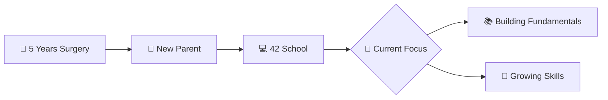

#

---

## 🌟 The Story

**Healthcare professional turned aspiring developer**
Learning to code while juggling surgery schedules, a newborn, and a toddler.
xac

```mermaid
graph LR
    A[🏥 5 Years Surgery] --> B[👶 New Parent]
    B --> C[💻 42 School]
    C --> D{🎯 Current Focus}
    D --> E[📚 Building Fundamentals]
    D --> F[🚀 Growing Skills]
```

**Real talk:** Some projects take multiple attempts. Some days I code at 3 AM between feedings. Every small step forward is a victory.

---

## 💻 Current Learning Stack

| 🛠️ Technology | 📊 Level | 🎯 Focus |
|:-------------|:--------:|:---------|
| **C Programming** | 🟩🟩🟩🟨⬜ | Memory management, pointers |
| **Algorithms** | 🟩🟩🟨⬜⬜ | Problem-solving, optimization |
| **System Programming** | 🟩🟩🟩⬜⬜ | Unix, processes, signals |
| **Web Development** | 🟩🟩🟩🟩⬜ | HTML, CSS, JavaScript basics |

### 🏆 42 Porto Projects

<table>
<tr>
<td align="center">

**C Library Recreation**

</td>
<td align="center">

**File I/O Learning**

</td>
<td align="center">

**Format Functions**

</td>
</tr>
</table>

---

## 🩺➡️💻 Healthcare to Tech

**What transfers from surgery to coding:**
- **Problem-solving under pressure** → Debug critical issues
- **Attention to detail** → Code quality and testing
- **Continuous learning** → Staying updated with tech
- **Team collaboration** → Working with dev teams
- **Crisis management** → Handling production issues

---

## 📊 GitHub Stats

---

## 🚀 What's Next

**October 2025:** SEA:ME Automotive Program
**Vision:** Bridging healthcare precision with automotive safety tech

---

## 🤝 Let's Connect

**Based in Ovar, Portugal 🇵🇹**
*Open to junior dev opportunities & learning collaborations*

### *"Learning to code one sleepless night at a time"* ✨

